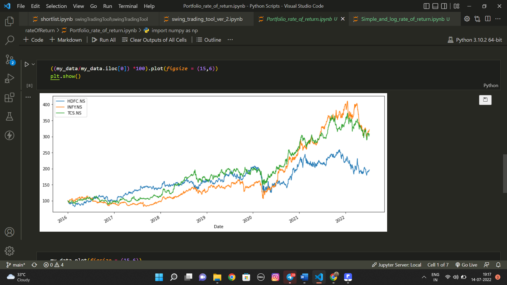
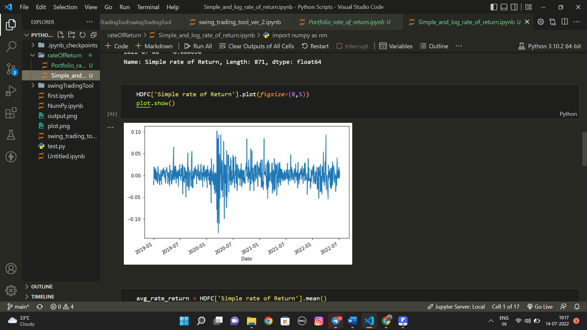
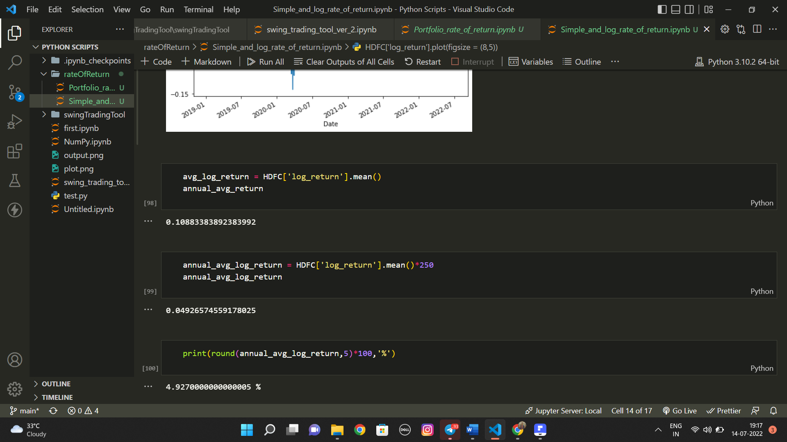

<h1>Rate of Return Calculations</h1>

This project consist of two jupyter notebooks, first Simple_rate_of_return.ipynb which can be used to calculate rate of return of single stock option and second, portfolio_reate_of_return.ipynb calculate rate of return for entire portfolio/pool of stcok options

